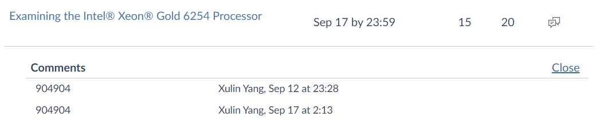

# comp90025-assignment-01
COMP90025 - Parallel and Multicore Computing - 2020S2 - Assignment1

# Quiz Instructions
Project 1 will be broken into small weekly quizzes, often of a single question, requiring an answer of a few hundred words.

Some of the questions will be revision of undergraduate concepts, and some will be about new content learned in this subject

# Week 2 homework: basic computer architecture
## Question 1 (10 pts)
```
Describe, in up to 100 words, the roles of the following main components:
- CPU
- Memory
- Bus
and how they work together. Talk about "address", "word size", "clock frequency", "instruction", "data" and the fetch-decode-execute-writeback concept, in relation to these main components.
```
- ```
    CPU is a piece of hardware that executes stored program instructions.

    Memory holds the instructions and data processed by CPU.

    CPU access the RAM using a Fetch-Decode-Execute-Writeback cycle. CPU read instruction from RAM in Fetch and put results back in Writeback from locations in memory as identified by the addresses. Each stage in the cycle demands a clock cycle and clock frequency is clock cycles per second to measure the performance of a CPU.

    The bus carries data, address, and control information in Fetch-Decode-Execute-Writeback cycle to connect CPU and memory. The standard single unit of bits for information transferred in between is word size. It shows the memory address size and the largest integer can be processed in a single instruction.
    ```

    my answer
- results
  - 
# Week 3 homework: Processor architecture
## Question 1 (10 pts)
```
Explain in about 300 words the role of registers and cache in a computer. How are they similar?  How are they different?  Where do they fit in the overall architecture?  How do they make computers run fast?
```
- ```
    Register is a quickly directly accessible location inside a computer's processor. It can hold an instruction being executed, a storage address, or immediately used data. Register can improve overall system speed because it has fastest accessing speed (1 clock cycle) because of a smaller capacity compared to cache. As it is an internal CPU “memory”, accesses to registers are faster than any other kind of memory accesses.

    Cache is a hardware/software component that is fast copy of recently used data from the main memory which can accelerate memory access speed. Cache makes computer run fast because the frequent slower small memory storage retrievals from main memory (Processor-Memory read operation time gap) is reduced as it is stored in cache with a faster access speed because of a smaller capacity compared to RAM.

    Both provide faster memory storage access for the processor. All of them are integrated in a CPU chip. The similarities are both can store data/instructions information. They have common goals to speed up the computer’s execution. Both have a faster-accessing speed than RAM. Register and L1 cache are both separated per core.

    The differences are: Registers are normally at the top of the memory hierarchy and provide the fastest way to access data. While cache is below register but above RAM with a larger storage size than register but with a slower accessing speed (3-5 times larger). Register is closer to ALU than cache. Register holds the data that CPU is currently processing whereas, cache holds instruction/data might be required. Cache has different level hierarchy inside it while register only has different types for various specialization. For example, general-purpose register can store a data or memory location address, but data registers can be assigned to a variety of functions by the programmer. Register is separated per core while L2&L3 cache is shared between cores. The memory inside the cache is addressable, whereas registers (almost always) are not.
    ```

    my answer
- results
  - 

# Week 4 homework: Threads and context switching
## Question 1 (10 pts)
```
In about 200 words, explain the difference between a thread and a process. Explain the difference between a kernel level thread and a user level thread and any implications in a multi-core system. Discuss what is meant by context switch. What are the events or conditions that can cause a context switch? Explain how excessive context switching can lead to severe performance penalties with respect to the memory hierarchy.
```
- ```
    Process means the program under execution. Thread is the segment (light-weight version) of a process. Process requires more time to terminate, create, context switch and more resource when running. Thread is more efficient for communication, has shared memory, stack and address space. Multiple processes are independent of each other while one thread can read/modify another thread's data.
 
    User Level Threads (ULT) are user-managed threads, but Kernel Level Threads (KLT) are OS managed. Thus, OS is only aware of single ULT (the executing one), even when there are more than one. So, we can run several KLT in parallel on a multi-core computer system while ULT cannot. ULT is small and much faster than KLT.
    
    Context switch is the process of storing the state of a process/thread so that it can be resumed later. It is triggered when a process making itself terminated for other processes to execute in multitasking or an interrupt occurs or there is a transition between the user mode and kernel mode in the OS. When it happens, process-specific register data will be saved and process-specific L1 cache with virtual address will be flushed to RAM. So, writeback data down the memory hierarchy can be slow. Thus, excessive context switching will introduce performance penalties.
    ```

    my answer
- results
  - 
# Week 5: Memory allocation in C
## Question 1 (10 pts)
```
Using 100-200 words, briefly explain the following storage classes in C++: auto, register, static. Briefly explain dynamic memory allocation and the difference between stack and heap memory. State any important performance related aspects for these concepts.
```
- ```
    Auto is the default storage class for local variables. It allocates runtime stack memory for variables. Auto improves performance by avoiding silent implicit conversions. Static stores variable in reserved data area makes its value unchanged throughout program execution. Performance can be improved as you don’t need to allocate memory for static variable each time you enter in its scope, you already have access to where it is stored in the data area. Register defines the variable will be stored in the hardware register. Consequently, storing frequently used variable in register provides a faster access speed than RAM to improve performance. Auto and register’s lifetime is within function/block while static is whole program. All their visibility is within function/block. Static has an initial value as 0 while auto and register’s initial value is garbage.

    Dynamic memory allocation (DMA) means the mechanism we used for allocating/specifying arbitrary memory space for variables in the program during runtime instead of specifying before compiling. A stack memory stores temporary variables created by a function. The memory allocation is done by compiler instructions. Heap is unlike stack; we need to manually and dynamically allocate memory in heap for the program. Heap variables can be resized. So, heap supports DMA. Stack has a faster access speed.
    ```

    my answer
- results
  - 
# Examining the Intel® Xeon® Gold 6254 Processor
## Question 1 (20 pts)
```
The Spartan physg5,avx512 partition contains 41 nodes, with each node having four Intel(R) Xeon(R) Gold 6254 processors or "sockets" in sbatch terminology.  From the first URL given below this processor has 18 physical cores, so each node has 72 physical cores in total. The number of virtual cores is however 144. The processor uses the Cascade Lakes architecture and a 20 core version of the processor architecture (Xeon Gold 6248, with more cores than the Gold6254 but slower clock speed) is shown in the second URL, where 2 such processors are shown connected together over an UltraPath Interconnect (that would be on the main board of the node). Also the cache hierarchy is described, with respect to cores. In about 200 words, discuss the implications of the Gold 6254 architecture, specifically with respect to its cache hierarchy, and with respect to using a multi-processor main board (i.e. four processor sockets) in each node, in terms of performance for OpenMP/OpenMPI programming.

https://ark.intel.com/content/www/us/en/ark/products/192451/intel-xeon-gold-6254-processor-24-75m-cache-3-10-ghz.html (Links to an external site.)

https://www.nas.nasa.gov/hecc/support/kb/cascade-lake-processors_579.html

```
- ```
    As Gold 6254 processor has larger L1/L2/L3 cache size than personal computer, OpenMP program’s performance is improved because more information can be stored in cache (cache-memory read/writeback times reduced). L1/L2 cache is private to each core while L3 is shared between cores. In previous week tutorial, we are told L2 cache is shared. Private L2 cache means private bus to L2 results in less contention. 1MB private L2 cache has a faster access speed as it is usually smaller than shared L2 cache size. The cores in Gold 6254 processor is organized in rows and columns rather than ring architecture which improves communication speed between cores for OpenMP program.

    As 4 Gold 6254 processors on the board are interconnected by UltraPath Interconnect (UPI) links (10.4 GT/s) and bandwidth is 62.4 GB/s, the inter-socket communication time for OpenMPI program between processors in a node is fast. Although the node network communication time between nodes in physical partition is fast, this is still longer than inter-socket communication time on the main board for OpenMPI program. So, choice of nodes required for OpenMPI program is still a crucial consideration. 

    Gold 6254 processor supports AVX. So OpenMP program can benefit from AVX optimization speedup as it is SPMD. However, OpenMPI program cannot as it is MPMD and AVX only supports SPMD.
    ```

    my answer
- results
  - 
